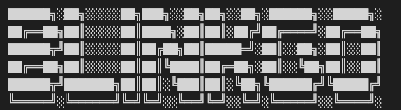

# blinkgo

[](https://goreportcard.com/report/github.com/rekram1-node/blinkgo) [](https://github.com/rekram1-node/blinkgo/blob/main/LICENSE)  []()




Simple library for interacting with blink cameras, mainly: authentication, listing devices/networks/clips, and downloading clips from local storage

This library was made for my purposes but if you would like to see more features open an issue and I will get to it

Credit to MattTW, who's findings: [BlinkMonitorProtocol](https://github.com/MattTW/BlinkMonitorProtocol) I used to create this implementation

## Features

* authentication
* read networks, cameras, sync modules
* list videos
* download videos

## Getting Started

### Prerequisites
- [Go](https://go.dev/)

### Getting blinkgo

With [Go module](https://github.com/golang/go/wiki/Modules) support, simply add the following import

```go
import "github.com/rekram1-node/blinkgo/blink"
```

to your code, and then `go [build|run|test]` will automatically fetch the necessary dependencies.

Otherwise, run the following to install the `blinkgo` library

```shell
$ go get -u github.com/rekram1-node/blinkgo/blink
```

## Documentation

Read the [documentation](https://github.com/rekram1-node/blinkgo/blob/main/docs/docs.md) for usage instructions


## Authentication

#### Simple login and 2FA verify pin
```go
package main

import (
	"fmt"
	"log"

	"github.com/rekram1-node/blinkgo/blink"
)

func main() {
	email := "example@example.com"
	password := "PLEASE_DON'T_PLAINTEXT_REAL_PASSWORDS"

	// returns account object with: email, password, uuid
	// this is required for login and once authenticated, used
	// for any blink operations
	account := blink.NewAccount(user, pass)

	loginResp, err := account.Login()

	if err != nil {
		log.Fatal(err)
	}

	// if blink wants a 2FA verification you must use the 
	// verify pin operation
	// 2FA is not always required but it is typically
	// required first time on new device
	if loginResp.Account.AccountVerificationRequired {
		fmt.Print("Enter Pin: ")
		var pin string
		fmt.Scanln(&pin)

		// this returns a verify pin response that you can use
		// however, it is unneccessary for this example
		if _, err := account.VerifyPin(pin); err != nil {
			log.Fatal(err)
		}
	}
}
```

## Local-Storage

I did not discover this myself, this is from [blinkpy](https://github.com/fronzbot/blinkpy)

The steps for pulling videos from local storage

1. Query sync module for information regarding stored clips
2. Upload the clips to the cloud
3. Download the clips from a cloud URL

Beware the upload/download sequence, there must be a waiting period between the two as the operation is not instantenous

## Issues

If you have an issue: report it on the [issue tracker](https://github.com/rekram1-node/blinkgo/issues)
